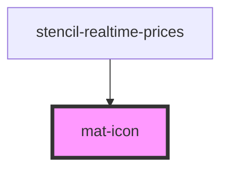

# mat-icon

<!-- Auto Generated Below -->

## Properties

| Property    | Attribute   | Description | Type      | Default |
| ----------- | ----------- | ----------- | --------- | ------- |
| `clickable` | `clickable` |             | `boolean` | `false` |

## Events

| Event       | Description | Type               |
| ----------- | ----------- | ------------------ |
| `iconClick` |             | `CustomEvent<any>` |

## Dependencies

### Used by

 - [stencil-realtime-prices](../realtime-prices)

### Graph

----------------------------------------------

*Built with [StencilJS](https://stenciljs.com/)*
