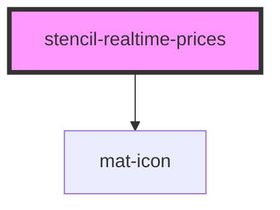

# stencil-realtime-prices

<!-- Auto Generated Below -->

## Properties

| Property       | Attribute       | Description | Type             | Default                                                                                                                                                                                                                                                                                                                                                                                                                                       |
| -------------- | --------------- | ----------- | ---------------- | --------------------------------------------------------------------------------------------------------------------------------------------------------------------------------------------------------------------------------------------------------------------------------------------------------------------------------------------------------------------------------------------------------------------------------------------- |
| `primaryColor` | `primary-color` |             | `string`         | `''`                                                                                                                                                                                                                                                                                                                                                                                                                                          |
| `rowData`      | --              |             | `any[]`          | `[     {       productLoanX: 'LXJim',       issuer: 'Jim',       bidPrice: 101,       offerPrice: 210     },     {       bidPrice: 190,       productLoanX: 'LXLarry',       issuer: 'Larry',       offerPrice: 210     },     { productLoanX: 'LXAdam', issuer: 'Adam', bidPrice: 105, offerPrice: 240 }   ]`                                                                                                                                |
| `tableHeaders` | --              |             | `ColumnHeader[]` | `[     {       displayName: 'LoanX',       field: 'productLoanX',       sortType: 'string'     },     {       displayName: 'Issuer',       field: 'issuer',       sortType: 'string'     },     {       displayName: 'Bid Price',       field: 'bidPrice',       sortType: 'number',       editable: true     },     {       displayName: 'Offer Price',       field: 'offerPrice',       sortType: 'number',       editable: true     }   ]` |

## Dependencies

### Depends on

- [mat-icon](../mat-icon)

### Graph

----------------------------------------------

*Built with [StencilJS](https://stenciljs.com/)*
