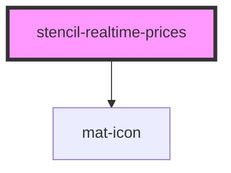

# stencil-realtime-prices

<!-- Auto Generated Below -->

## Properties

| Property       | Attribute       | Description                 | Type             | Default   |
| -------------- | --------------- | --------------------------- | ---------------- | --------- |
| `primaryColor` | `primary-color` | An HTML or hex color string | `string`         | `'black'` |
| `rowData`      | --              |                             | `any[]`          | `[]`      |
| `tableHeaders` | --              |                             | `ColumnHeader[]` | `[]`      |

## Events

| Event            | Description                                                                                      | Type               |
| ---------------- | ------------------------------------------------------------------------------------------------ | ------------------ |
| `rowDataChanged` | This is a pointless @event rowDataSorted that lets the parent know when rowData has been sorted. | `CustomEvent<any>` |

## Dependencies

### Depends on

- [mat-icon](../mat-icon)

### Graph

----------------------------------------------

*Built with [StencilJS](https://stenciljs.com/)*
